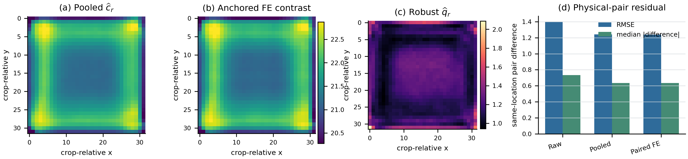

# Position-Calibrated Tiled Fabric Inspection

Official reproducibility repository for **Position-Calibrated Dual Readout for PatchCore-Based Tiled Fabric Anomaly Inspection**.

High-resolution fabric images are commonly inspected as overlapping tiles. A physical point can then receive different anomaly responses depending on where it falls inside a tile. Position-Calibrated Dual Readout (PCDR) estimates this repeatable tile-coordinate response pattern from source-normal images and uses two task-specific readouts:

- a bias-corrected Gaussian reconstruction for dense defect localization;
- Position-Calibrated Aligned Fusion (PCAF) for parent-image alarming and source-normal threshold calibration.

Both readouts reuse the same frozen PatchCore crop maps. PCDR requires no defect labels, detector retraining, second network, or additional crop acquisition beyond the chosen tiled scan.



## Main result

Rollo4A was used for method development. On the other six RAW-FABRID rolls, the frozen PCDR localization readout reaches a macro Pixel AP of **0.3017**, compared with **0.2963** for the fair Hann--PCAF dual-output reference, a paired change of **+0.0053**. It exceeds each roll's strongest single-field reference on **5/6** candidate-evaluation rolls. All parent scores and source-calibrated operating-point metrics are exactly inherited from the PCAF alarm readout.

Two closing controls test the main alternative explanations. On native unsmoothed `32 x 32` patch-score fields, the six-roll macro Pixel-AP gain over Hann remains **+0.0058**. On 15 scene-grouped OLP textures, complete PCDR improves over Hann--PCAF on **12/15** textures with a macro change of **+0.0038**, although the textile-bootstrap interval crosses zero.

The repository also retains the complete seven-roll diagnostic records, fixed-window controls, a same-location fixed-effect audit, the grouped OLP external evaluation, qualitative-case selection records, and a computation-aware sequential-acquisition extension. These supporting studies are kept separate from the six-roll candidate-evaluation estimate.

## Repository layout

- `configs/`: frozen experiment specifications;
- `tools/`: PCDR, PCAF, baseline, audit, and summarization programs;
- `runs/`: immutable per-fold JSON outputs and aggregate summaries;
- `data/OLP/`: metadata-only scene-grouping and subset manifests;
- `assets/`: the coordinate-calibration audit figure;
- `release_manifest.json`: SHA-256 inventory of the public package.

The repository intentionally excludes the paper source, submission files, internal work logs, model checkpoints, and third-party image data. The qualitative selection record is included, but its RAW-FABRID image archive is not redistributed.

For a stranger-oriented code map, exact environment, dataset layout, and the
difference between record-level and end-to-end reproduction, see
[`REPRODUCING.md`](REPRODUCING.md).

## Verify the released records

Python 3.10 is recommended. The checksum audit uses only the standard library:

```bash
python tools/verify_release.py
python tools/reproduce_reported_tables.py
```

The principal aggregate tables can be regenerated directly from the committed fold records:

```bash
python tools/summarize_raw_fabrid_dual_readout_fusion_k2.py \
  runs/raw_fabrid_dual_readout_fusion_k2/all_folds \
  outputs/dual_readout_summary.json outputs/dual_readout_summary.md

python tools/summarize_raw_fabrid_coordinate_fixed_effect_audit.py \
  runs/raw_fabrid_coordinate_fixed_effect_audit/full \
  outputs/fixed_effect_summary.json outputs/fixed_effect_summary.md

python tools/summarize_olp_pcdr_external_k2.py \
  runs/olp_pcdr_external_k2/final_checkpoint_replay \
  outputs/olp_pcdr_summary.json

python tools/summarize_raw_fabrid_patch_score_field_control_k3.py \
  runs/raw_fabrid_patch_score_field_control_k3/all_folds \
  outputs/patch_score_field_summary.json

python tools/test_patchcore_field_variants.py
```

Run each program with `--help` before use; the frozen runner scripts remain available for the original experiment layout.

## End-to-end reproduction

The reported detector runs used Python 3.10, PyTorch 2.5.1 with CUDA 12.4,
anomalib 2.5.1, and an RTX 4090. Install the matching PyTorch/torchvision build
from `requirements-cuda124.txt` first, then install `requirements.txt`. Other
recent environments may regenerate the JSON summaries, but they are not the
claimed detector environment.

End-to-end reruns additionally require:

1. the official RAW-FABRID, ISP-AD, or OLP data obtained from their respective providers;
2. the dataset paths in the selected JSON configuration to be adapted to the local machine;
3. fold-specific PatchCore checkpoints, either retrained with the deterministic grouped protocol or supplied separately.

The committed JSON records include configuration, implementation, and checkpoint hashes used by the reported runs. Historical absolute paths in frozen configurations record the original machine layout; they are not credentials and should be changed only in a copied configuration.

## Evaluation boundaries

- Parents and rolls, not crops, are the experimental units.
- The six-roll confirmation result is candidate-unseen but not a fully blind dataset evaluation: reference outputs existed before the candidate readout was frozen.
- ISP-AD is used only as label-free evidence that identical registered content can receive crop-dependent detector responses.
- OLP trains and calibrates one detector per textile, groups images by acquisition scene, and summarizes by textile; it is supporting acquisition-and-texture evidence, not zero-shot transfer or a cross-roll test.
- The sequential extension reduces average crop count but is not lossless and is not part of the primary PCDR claim.

## Citation

The manuscript is being prepared for journal submission. Citation metadata will be updated with the journal record or preprint identifier when available.

## Provenance

`SOURCE_COMMIT` records the final source commit in the author's non-public
development repository. The manuscript's abbreviated identifiers `f853e05`
and `e982991` refer to the same private development history, so they are
provenance labels rather than objects that can be checked out from this public
repository. Reproducible public snapshots are identified by the immutable
`tvc-submission-*` tags in this repository.

## License

This submission-stage repository is publicly accessible for peer review and
reproducibility auditing, but it is not released as open-source software. No
permission to reuse, modify, or redistribute the original code or
documentation is granted. All rights are reserved; see [`LICENSE`](LICENSE).
Third-party assets remain subject to their own terms.
